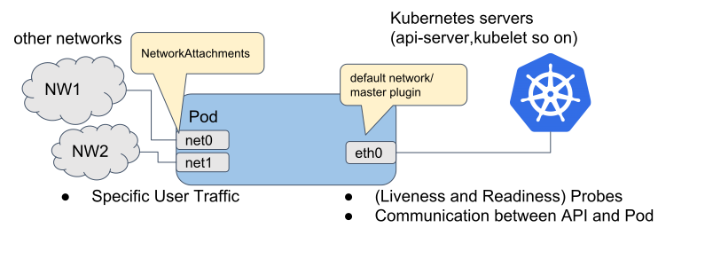

# Multus-CNI


[](https://travis-ci.org/intel/multus-cni/builds)[](https://goreportcard.com/report/github.com/intel/multus-cni)

Multus CNI enables attaching multiple network interfaces to pods in Kubernetes.

## How it works

Multus CNI is a container network interface (CNI) plugin for Kubernetes that enables attaching multiple network interfaces to pods. Typically, in Kubernetes each pod only has one network interface (apart from a loopback) -- with Multus you can create a multi-homed pod that has multiple interfaces. This is accomplished by Multus acting as a "meta-plugin", a CNI plugin that can call multiple other CNI plugins.

Multus CNI follows the [Kubernetes Network Custom Resource Definition De-facto Standard](https://docs.google.com/document/d/1Ny03h6IDVy_e_vmElOqR7UdTPAG_RNydhVE1Kx54kFQ/edit) to provide a standardized method by which to specify the configurations for additional network interfaces. This standard is put forward by the Kubernetes [Network Plumbing Working Group](https://docs.google.com/document/d/1oE93V3SgOGWJ4O1zeD1UmpeToa0ZiiO6LqRAmZBPFWM/edit).

Multus is one of the projects in the [Baremetal Container Experience kit](https://networkbuilders.intel.com/network-technologies/container-experience-kits)

### Multi-Homed pod

Here's an illustration of the network interfaces attached to a pod, as provisioned by Multus CNI. The diagram shows the pod with three interfaces: `eth0`, `net0` and `net1`. `eth0` connects kubernetes cluster network to connect with kubernetes server/services (e.g. kubernetes api-server, kubelet and so on). `net0` and `net1` are additional network attachments and connect to other networks by using [other CNI plugins](https://kubernetes.io/docs/concepts/extend-kubernetes/compute-storage-net/network-plugins/) (e.g. vlan/vxlan/ptp).



## Quickstart Installation Guide

Multus may be deployed as a Daemonset, and is provided in this guide along with Flannel. Flannel is deployed as a pod-to-pod network that is used as our "default network" (a network interface that every pod will be created with). Each network attachment is made in addition to this default network.

Firstly, clone this GitHub repository. We'll apply files to `kubectl` from this repo.

We apply these files as such:

```
$ cat ./images/{multus-daemonset.yml,flannel-daemonset.yml} | kubectl apply -f -
```

This will configure your systems to be ready to use Multus CNI, but, to get started with adding additional interfaces to your pods, refer to our complete [quick-start guide](doc/quickstart.md)

## Additional installation Options

- Install via daemonset using the quick-start guide, above.
- Download binaries from [release page](https://github.com/intel/multus-cni/releases)
- By Docker image from [Docker Hub](https://hub.docker.com/r/nfvpe/multus/tags/)
- Or, roll-you-own and build from source
  - See [Development](doc/development.md)

## Comprehensive Documentation

- [How to use](doc/how-to-use.md)
- [Configuration](doc/configuration.md)
- [Development](doc/development.md)

## Contact Us

For any questions about Multus CNI, feel free to ask a question in #general in the [Intel-Corp Slack](https://intel-corp.herokuapp.com/), or open up a GitHub issue. 
