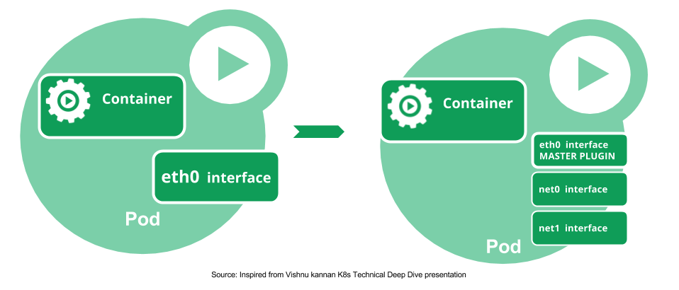
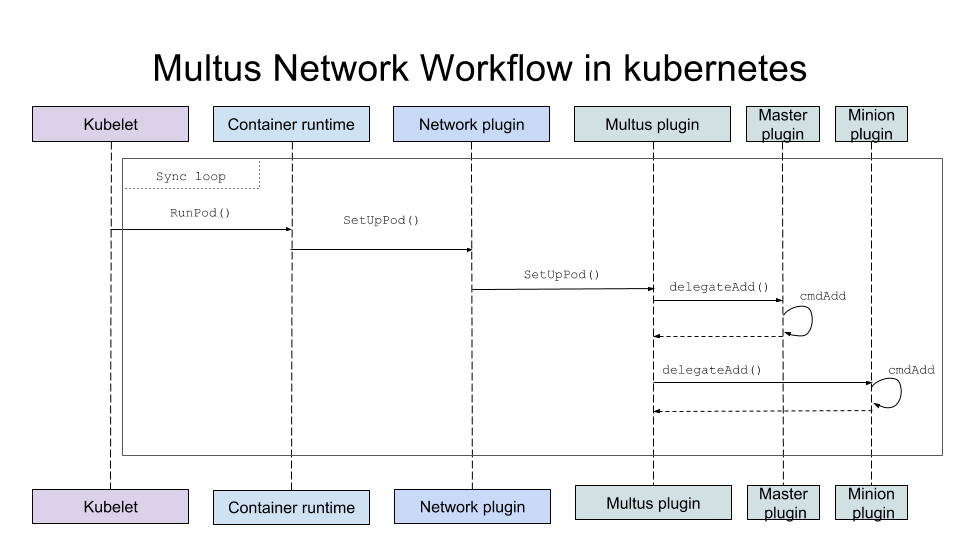
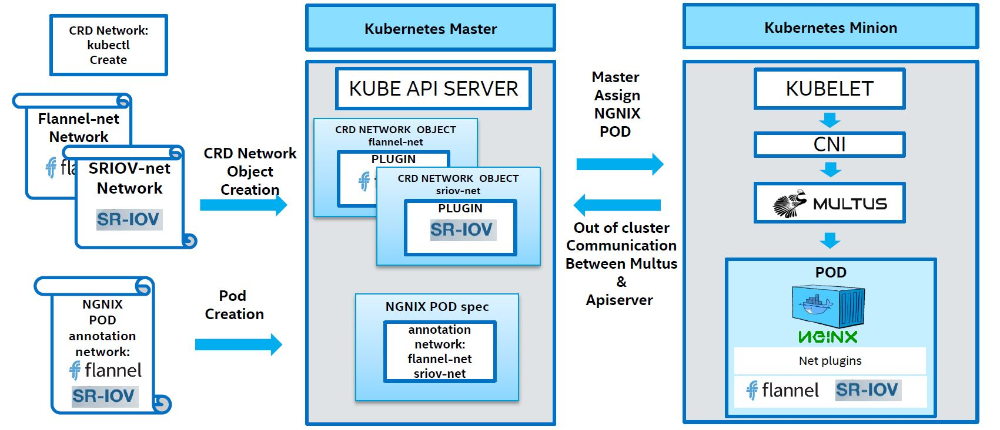

[](https://travis-ci.org/intel/multus-cni/builds)[](https://goreportcard.com/report/github.com/intel/multus-cni)

   * [MULTUS CNI plugin](#multus-cni-plugin)
      * [Quickstart Guide](#quickstart-guide)
      * [Multi-Homed pod](#multi-homed-pod)
      * [Building from source](#building-from-source)
      * [Work flow](#work-flow)
      * [Usage with Kubernetes CRD based network objects](#usage-with-kubernetes-crd-based-network-objects)
         * [Creating "Network" resources in Kubernetes](#creating-network-resources-in-kubernetes)
            * [<strong>CRD based Network objects</strong>](#crd-based-network-objects)
         * [Configuring Multus to use the kubeconfig](#configuring-multus-to-use-the-kubeconfig)
         * [Configuring Multus to use kubeconfig and a default network](#configuring-multus-to-use-kubeconfig-and-a-default-network)
         * [Configuring Pod to use the CRD network objects](#configuring-pod-to-use-the-crd-network-objects)
         * [Verifying Pod network interfaces](#verifying-pod-network-interfaces)
      * [Using with Multus conf file](#using-with-multus-conf-file)
      * [Logging Options](#logging-options)
      * [Testing Multus CNI](#testing-multus-cni)
         * [Multiple flannel networks](#multiple-flannel-networks)
            * [Configure Kubernetes with CNI](#configure-kubernetes-with-cni)
            * [Launching workloads in Kubernetes](#launching-workloads-in-kubernetes)
      * [Multus additional plugins](#multus-additional-plugins)
      * [NFV based networking in Kubernetes](#nfv-based-networking-in-kubernetes)
      * [Need help](#need-help)
      * [Contacts](#contacts)

# MULTUS CNI plugin
- _Multus_ is a latin word for &quot;Multi&quot;
- As the name suggests, it acts as a Multi plugin in Kubernetes and provides the multiple network interface support in a pod
- Multus supports all [reference plugins](https://github.com/containernetworking/plugins) (eg. [Flannel](https://github.com/containernetworking/plugins/tree/master/plugins/meta/flannel), [DHCP](https://github.com/containernetworking/plugins/tree/master/plugins/ipam/dhcp), [Macvlan](https://github.com/containernetworking/plugins/tree/master/plugins/main/macvlan)) that implement the CNI specification and all 3rd party plugins (eg. [Calico](https://github.com/projectcalico/cni-plugin), [Weave](https://github.com/weaveworks/weave), [Cilium](https://github.com/cilium/cilium), [Contiv](https://github.com/contiv/netplugin)). In addition to it, Multus supports [SRIOV](https://github.com/hustcat/sriov-cni), [SRIOV-DPDK](https://github.com/Intel-Corp/sriov-cni), [OVS-DPDK &amp; VPP](https://github.com/intel/vhost-user-net-plugin) workloads in Kubernetes with both cloud native and NFV based applications in Kubernetes
- It is a contact between the container runtime and other plugins, and it doesn&#39;t have any of its own net configuration, it calls other plugins like flannel/calico to do the real net conf job.
- Multus reuses the concept of invoking delegates as used in flannel by grouping multiple plugins into delegates and invoking them in the sequential order of the CNI configuration file provided in json format
- The default network gets "eth0" and additional network Pod interface name as “net0”, “net1”,… “netX and so on. Multus also support interface names from the user.
- Multus is one of the projects in the [Baremetal Container Experience kit](https://networkbuilders.intel.com/network-technologies/container-experience-kits).

Please check the [CNI](https://github.com/containernetworking/cni) documentation for more information on container networking.

# Quickstart Guide

Multus may be deployed as a Daemonset, and is provided in this guide along with Flannel. Flannel is deployed as a pod-to-pod network that is used as our "default network". Each network attachment is made in addition to this default network.

Firstly, clone this GitHub repository. We'll apply files to `kubectl` from this repo.

We apply these files as such:

```
$ cat ./images/{multus-daemonset.yml,flannel-daemonset.yml} | kubectl apply -f -
```

Create a CNI configuration loaded as a CRD object, in this case a macvlan CNI configuration is defined. You may replace the `config` field with any valid CNI configuration where the CNI binary is available on the nodes.

```
cat <<EOF | kubectl create -f -
apiVersion: "k8s.cni.cncf.io/v1"
kind: NetworkAttachmentDefinition
metadata:
  name: macvlan-conf
spec: 
  config: '{
      "cniVersion": "0.3.0",
      "type": "macvlan",
      "master": "eth0",
      "mode": "bridge",
      "ipam": {
        "type": "host-local",
        "subnet": "192.168.1.0/24",
        "rangeStart": "192.168.1.200",
        "rangeEnd": "192.168.1.216",
        "routes": [
          { "dst": "0.0.0.0/0" }
        ],
        "gateway": "192.168.1.1"
      }
    }'
EOF
```

You may then create a pod which attached this additional interface, where the annotation correlates to the `name` in the `NetworkAttachmentDefinition` above.

```
cat <<EOF | kubectl create -f -
apiVersion: v1
kind: Pod
metadata:
  name: samplepod
  annotations:
    k8s.v1.cni.cncf.io/networks: macvlan-conf
spec:
  containers:
  - name: samplepod
    command: ["/bin/bash", "-c", "sleep 2000000000000"]
    image: dougbtv/centos-network
EOF
```

You may now inspect the pod and see that there is an additional interface configured, like so:

```
$ kubectl exec -it samplepod -- ip a
```

# Kubernetes Network Custom Resource Definition De-facto Standard - Reference implementation

* This project is a reference implementation for Kubernetes Network Custom Resource Definition De-facto Standard. For more information refer [Network Plumbing Working Group Agenda](https://docs.google.com/document/d/1oE93V3SgOGWJ4O1zeD1UmpeToa0ZiiO6LqRAmZBPFWM/edit)
* Kubernetes Network Custom Resource Definition De-facto Standard [documentation link](https://docs.google.com/document/d/1Ny03h6IDVy_e_vmElOqR7UdTPAG_RNydhVE1Kx54kFQ/edit)
* Reference implementation support following modes
   * CNI config JSON in network object
   * Not using CNI config (“thick” plugin usecase)
   * CNI configuration stored in on-disk file
   > refer the section 3.2 Network Object Definition for more details in Kubernetes Network Custom Resource Definition De-facto Standard
* Refer the reference implemenation presentation and demo details - [link](https://docs.google.com/presentation/d/1dbCin6MnhK-BjjcVun5YiPTL99VA2uSiyWAtWAPNlIc/edit?usp=sharing)
* Release version from v2.0 is not compatible with v1.1 and v1.2 network CRD 
  * [MULTUS CNI plugin](#multus-cni-plugin)specifications.

## Multi-Homed pod
<p align="center">
   
</p>

## Building from source

**This plugin requires Go 1.8 (or later) to build.**

```
#./build
```

## Work flow
<p align="center">
   
</p>

## Network configuration reference

- name (string, required): the name of the network
- type (string, required): &quot;multus&quot;
- kubeconfig (string, optional): kubeconfig file for the out of cluster communication with kube-apiserver. See the example [kubeconfig](https://github.com/intel/multus-cni/blob/master/doc/node-kubeconfig.yaml)
- delegates (([]map,required): number of delegate details in the Multus

## Usage with Kubernetes CRD based network objects

Kubelet is responsible for establishing network interfaces for pods; it does this by invoking its configured CNI plugin. When Multus is invoked it retrieves network references from Pod annotation. Multus then uses these network references to get network configurations. Network configurations are defined as Kubernetes Custom Resource Object (CRD). These configurations describe which CNI plugins to invoke and what their configurations are. The order of plugin invocation is important as it identifies the primary plugin. This order is taken from network object references given in a Pod spec.

<p align="center">
   
</p>

### Creating &quot;Network&quot; resources in Kubernetes

You may wish to create the `network-attachment-definition` manually if you haven't installed using the daemonset technique, which includes the CRD, and you can verify if it's loaded with `kubectl get crd` and look for the presence of `network-attachment-definition`.

1. Create a Custom Resource Definition (CRD) `crdnetwork.yaml`; for the network object using the YAML from the examples directory.

```
$ kubectl create -f ./examples/crd.yml
customresourcedefinition.apiextensions.k8s.io/network-attachment-definitions.k8s.cni.cncf.io created
```

3. Run kubectl get command to check the Network CRD creation

```
$ kubectl get crd
NAME                      KIND
network-attachment-definitions.k8s.cni.cncf.io   CustomResourceDefinition.v1beta1.apiextensions.k8s.io
```

### Creating CRD network resources in Kubernetes

1. After creating CRD network object you can create network resources in Kubernetes. These network resources may contain additional underlying CNI plugin parameters given in JSON format. In the following example shown below the args field contains parameters that will be passed into Flannel plugin.

2. Save the following YAML to flannel-network.yaml

```
apiVersion: "k8s.cni.cncf.io/v1"
kind: NetworkAttachmentDefinition
metadata:
  name: flannel-networkobj
spec: 
  config: '{
    "cniVersion": "0.3.0",
    "type": "flannel",
    "delegate": {
      "isDefaultGateway": true
    }
  }'
```

3. Create the custom resource definition

```
$ kubectl create -f ./flannel-network.yaml
network "flannel-networkobj" created

$ kubectl get net-attach-def
NAME                         AGE
flannel-networkobj           26s
```

4. Get the custom network object details

```
apiVersion: k8s.cni.cncf.io/v1
kind: NetworkAttachmentDefinition
metadata:
  clusterName: ""
  creationTimestamp: 2018-05-17T09:13:20Z
  deletionGracePeriodSeconds: null
  deletionTimestamp: null
  initializers: null
  name: flannel-networkobj
  namespace: default
  resourceVersion: "21176114"
  selfLink: /apis/k8s.cni.cncf.io/v1/namespaces/default/networks/flannel-networkobj
  uid: 8ac8f873-59b2-11e8-8308-a4bf01024e6f
spec:
  config: '{ "cniVersion": "0.3.0", "type": "flannel", "delegate": { "isDefaultGateway":
    true } }'
```

5. Save the following YAML to sriov-network.yaml to creating sriov network object. ( Refer to [Intel - SR-IOV CNI](https://github.com/Intel-Corp/sriov-cni) or contact @kural in [Intel-Corp Slack](https://intel-corp.herokuapp.com/) for running the DPDK based workloads in Kubernetes)

```
apiVersion: "k8s.cni.cncf.io/v1"
kind: NetworkAttachmentDefinition
metadata:
  name: sriov-conf
spec:
  config: '{
    "type": "sriov",
    "if0": "enp12s0f1",
    "ipam": {
            "type": "host-local",
            "subnet": "10.56.217.0/24",
            "rangeStart": "10.56.217.171",
            "rangeEnd": "10.56.217.181",
            "routes": [
                    { "dst": "0.0.0.0/0" }
            ],
            "gateway": "10.56.217.1"
    }
  }'
```

6. Likewise save the following YAML to sriov-vlanid-l2enable-network.yaml to create another sriov based network object:

```
apiVersion: "k8s.cni.cncf.io/v1"
kind: NetworkAttachmentDefinition
metadata:
  name: sriov-vlanid-l2enable-conf
spec:
  config: '{
    "type": "sriov",
    "if0": "enp2s0",
    "vlan": 210,
    "l2enable": true
  }'
```

7. Follow step 3 above to create &quot;sriov-vlanid-l2enable-conf&quot; and &quot;sriov-conf&quot; network objects

8. View network objects using kubectl

```
# kubectl get net-attach-def
NAME                         AGE
flannel-networkobj           29m
sriov-conf                   6m
sriov-vlanid-l2enable-conf   2m

```

### Configuring Multus to use the kubeconfig

1. Create a Mutlus CNI configuration file on each Kubernetes node. This file should be created in: /etc/cni/net.d/multus-cni.conf with the content shown below. Use only the absolute path to point to the kubeconfig file (as it may change depending upon your cluster env). We are assuming all CNI plugin binaries are default location (`/opt/cni/bin dir`)

```
{
    "name": "node-cni-network",
    "type": "multus",
    "kubeconfig": "/etc/kubernetes/node-kubeconfig.yaml"
}
```

### Configuring Multus to use kubeconfig and a default network

1. Many users want Kubernetes default networking feature along with network objects. Refer to issues [#14](https://github.com/intel/multus-cni/issues/14) &amp; [#17](https://github.com/intel/multus-cni/issues/17) for more information. In the following Multus configuration, Weave act as the default network in the absence of network field in the pod metadata annotation.

```
{
    "name": "node-cni-network",
    "type": "multus",
    "kubeconfig": "/etc/kubernetes/node-kubeconfig.yaml",
    "delegates": [{
        "type": "weave-net",
        "hairpinMode": true
    }]
}
```

Configurations referenced in annotations are created in addition to the default network.

### Configuring Pod to use the CRD network objects

1. Save the following YAML to pod-multi-network.yaml. In this case flannel-conf network object acts as the primary network.
```
# cat pod-multi-network.yaml 
apiVersion: v1
kind: Pod
metadata:
  name: multus-multi-net-poc
  annotations:
    k8s.v1.cni.cncf.io/networks: '[
            { "name": "flannel-conf" },
            { "name": "sriov-conf" },
            { "name": "sriov-vlanid-l2enable-conf",
              "interfaceRequest": "north" }
    ]'
spec:  # specification of the pod's contents
  containers:
  - name: multus-multi-net-poc
    image: "busybox"
    command: ["top"]
    stdin: true
    tty: true
```

2. Create Multiple network based pod from the master node

```
# kubectl create -f ./pod-multi-network.yaml
pod "multus-multi-net-poc" created
```

3. Get the details of the running pod from the master

```
# kubectl get pods
NAME                   READY     STATUS    RESTARTS   AGE
multus-multi-net-poc   1/1       Running   0          30s
```

### Verifying Pod network interfaces

1. Run `ifconfig` command in Pod:

```
# kubectl exec -it multus-multi-net-poc -- ifconfig       
eth0      Link encap:Ethernet  HWaddr C6:43:7C:09:B4:9C
          inet addr:10.128.0.4  Bcast:0.0.0.0  Mask:255.255.255.0
          UP BROADCAST RUNNING MULTICAST  MTU:1450  Metric:1
          RX packets:8 errors:0 dropped:0 overruns:0 frame:0
          TX packets:1 errors:0 dropped:0 overruns:0 carrier:0
          collisions:0 txqueuelen:0
          RX bytes:648 (648.0 B)  TX bytes:42 (42.0 B)

lo        Link encap:Local Loopback  
          inet addr:127.0.0.1  Mask:255.0.0.0
          inet6 addr: ::1/128 Scope:Host
          UP LOOPBACK RUNNING  MTU:65536  Metric:1
          RX packets:0 errors:0 dropped:0 overruns:0 frame:0
          TX packets:0 errors:0 dropped:0 overruns:0 carrier:0
          collisions:0 txqueuelen:1 
          RX bytes:0 (0.0 B)  TX bytes:0 (0.0 B)
          
net0      Link encap:Ethernet  HWaddr 06:21:91:2D:74:B9  
          inet addr:192.168.42.3  Bcast:0.0.0.0  Mask:255.255.255.0
          inet6 addr: fe80::421:91ff:fe2d:74b9/64 Scope:Link
          UP BROADCAST RUNNING MULTICAST  MTU:1450  Metric:1
          RX packets:0 errors:0 dropped:0 overruns:0 frame:0
          TX packets:8 errors:0 dropped:0 overruns:0 carrier:0
          collisions:0 txqueuelen:0 
          RX bytes:0 (0.0 B)  TX bytes:648 (648.0 B)

net1      Link encap:Ethernet  HWaddr D2:94:98:82:00:00  
          inet addr:10.56.217.171  Bcast:0.0.0.0  Mask:255.255.255.0
          inet6 addr: fe80::d094:98ff:fe82:0/64 Scope:Link
          UP BROADCAST RUNNING MULTICAST  MTU:1500  Metric:1
          RX packets:2 errors:0 dropped:0 overruns:0 frame:0
          TX packets:8 errors:0 dropped:0 overruns:0 carrier:0
          collisions:0 txqueuelen:1000 
          RX bytes:120 (120.0 B)  TX bytes:648 (648.0 B)

north     Link encap:Ethernet  HWaddr BE:F2:48:42:83:12  
          inet6 addr: fe80::bcf2:48ff:fe42:8312/64 Scope:Link
          UP BROADCAST RUNNING MULTICAST  MTU:1500  Metric:1
          RX packets:1420 errors:0 dropped:0 overruns:0 frame:0
          TX packets:1276 errors:0 dropped:0 overruns:0 carrier:0
          collisions:0 txqueuelen:1000 
          RX bytes:95956 (93.7 KiB)  TX bytes:82200 (80.2 KiB)
```

| Interface name | Description |
| --- | --- |
| lo | loopback |
| eth0 | weave network interface |
| net0 | Flannel network tap interface |
| net1 | VF0 of NIC 1 assigned to the container by [Intel - SR-IOV CNI](https://github.com/intel/sriov-cni) plugin |
| north | VF0 of NIC 2 assigned with VLAN ID 210 to the container by SR-IOV CNI plugin |

2. Check the vlan ID of the NIC 2 VFs

```
# ip link show enp2s0
20: enp2s0: <BROADCAST,MULTICAST,UP,LOWER_UP> mtu 1500 qdisc mq state UP mode DEFAULT group default qlen 1000
    link/ether 24:8a:07:e8:7d:40 brd ff:ff:ff:ff:ff:ff
    vf 0 MAC 00:00:00:00:00:00, vlan 210, spoof checking off, link-state auto
    vf 1 MAC 00:00:00:00:00:00, vlan 4095, spoof checking off, link-state auto
    vf 2 MAC 00:00:00:00:00:00, vlan 4095, spoof checking off, link-state auto
    vf 3 MAC 00:00:00:00:00:00, vlan 4095, spoof checking off, link-state auto
```

## Using with Multus conf file

Given the following network configuration:

```
# tee /etc/cni/net.d/multus-cni.conf <<-'EOF'
{
    "name": "multus-demo-network",
    "type": "multus",
    "delegates": [
        {
                "type": "sriov",
                #part of sriov plugin conf
                "if0": "enp12s0f0", 
                "ipam": {
                        "type": "host-local",
                        "subnet": "10.56.217.0/24",
                        "rangeStart": "10.56.217.131",
                        "rangeEnd": "10.56.217.190",
                        "routes": [
                                { "dst": "0.0.0.0/0" }
                        ],
                        "gateway": "10.56.217.1"
                }
        },
        {
                "type": "ptp",
                "ipam": {
                        "type": "host-local",
                        "subnet": "10.168.1.0/24",
                        "rangeStart": "10.168.1.11",
                        "rangeEnd": "10.168.1.20",
                        "routes": [
                                { "dst": "0.0.0.0/0" }
                        ],
                        "gateway": "10.168.1.1"
                }
        },
        {
                "type": "flannel",
                "delegate": {
                        "isDefaultGateway": true
                }
        }
    ]
}
EOF
```

## Logging Options

You may wish to enable some enhanced logging for Multus, especially during the process where you're configuring Multus and need to understand what is or isn't working with your particular configuration. 

Multus will always log via `STDERR`, which is the standard method by which CNI plugins communicate errors, and these errors are logged by the Kubelet. This method is always enabled.

### Writing to a Log File

Optionally, you may have Multus log to a file on the filesystem. This file will be written locally on each node where Multus is executed. You may configure this via the `LogFile` option in the CNI configuration. By default this additional logging to a flat file is disabled.

For example in your CNI configuration, you may set:

```
    "LogFile": "/var/log/multus.log",
```

### Logging Level

The default logging level is set as `panic` -- this will log only the most critical errors, and is the least verbose logging level.

The available logging level values, in descreasing order of verbosity are:

* `debug`
* `error`
* `panic`

You may configure the logging level by using the `LogLevel` option in your CNI configuration. For example:

```
    "LogLevel": "debug",
```

## Testing Multus CNI

### Multiple flannel networks

Github user [YYGCui](https://github.com/YYGCui) has used multiple flannel network to work with Multus CNI plugin. Please refer to this [closed issue](https://github.com/intel/multus-cni/issues/7) for ,multiple overlay network support with Multus CNI.

Make sure that the multus, [sriov](https://github.com/Intel-Corp/sriov-cni), [flannel](https://github.com/containernetworking/cni/blob/master/Documentation/flannel.md), and [ptp](https://github.com/containernetworking/cni/blob/master/Documentation/ptp.md) binaries are in the /opt/cni/bin directories and follow the steps as mentioned in the [CNI](https://github.com/containernetworking/cni/#running-a-docker-container-with-network-namespace-set-up-by-cni-plugins)

#### Configure Kubernetes with CNI

Kubelet must be configured to run with the CNI network plugin. Edit `/etc/kubernetes/kubelet` file and add `--network-plugin=cni` flags in `KUBELET\_OPTS `as shown below:

```
KUBELET_OPTS="...
--network-plugin-dir=/etc/cni/net.d
--network-plugin=cni
"
```

Refer to the Kubernetes User Guide and network plugin for more information.
- [Single Node](https://kubernetes.io/docs/getting-started-guides/fedora/fedora_manual_config/)
- [Multi Node](https://kubernetes.io/docs/getting-started-guides/fedora/flannel_multi_node_cluster/)
- [Network plugin](https://kubernetes.io/docs/admin/network-plugins/)

#### Launching workloads in Kubernetes

With Multus CNI configured as described in sections above each workload launched via a Kubernetes Pod will have multiple network interfacesLaunch the workload using yaml file in the kubernetes master, with above configuration in the multus CNI, each pod should have multiple interfaces.

Note: To verify whether Multus CNI plugin is working correctly, create a pod containing one `busybox` container and execute `ip link` command to check if interfaces management follows configuration.

1. Create `multus-test.yaml` file containing below configuration. Created pod will consist of one `busybox` container running `top` command.

```
apiVersion: v1
kind: Pod
metadata:
  name: multus-test
spec:  # specification of the pod's contents
  restartPolicy: Never
  containers:
  - name: test1
    image: "busybox"
    command: ["top"]
    stdin: true
    tty: true

```

2. Create pod using command:

```
# kubectl create -f multus-test.yaml
pod "multus-test" created
```

3. Run &quot;ip link&quot; command inside the container:

```
# 1: lo: <LOOPBACK,UP,LOWER_UP> mtu 65536 qdisc noqueue qlen 1
    link/loopback 00:00:00:00:00:00 brd 00:00:00:00:00:00
3: eth0@if41: <BROADCAST,MULTICAST,UP,LOWER_UP,M-DOWN> mtu 1500 qdisc noqueue
    link/ether 26:52:6b:d8:44:2d brd ff:ff:ff:ff:ff:ff
20: net0: <BROADCAST,MULTICAST,UP,LOWER_UP> mtu 1500 qdisc mq qlen 1000
    link/ether f6:fb:21:4f:1d:63 brd ff:ff:ff:ff:ff:ff
21: net1: <BROADCAST,MULTICAST,UP,LOWER_UP> mtu 1500 qdisc mq qlen 1000
    link/ether 76:13:b1:60:00:00 brd ff:ff:ff:ff:ff:ff 
```

| Interface name | Description |
| --- | --- |
| lo | loopback |
| eth0@if41 | Flannel network tap interface |
| net0 | VF assigned to the container by [SR-IOV CNI](https://github.com/Intel-Corp/sriov-cni) plugin |
| net1 | ptp localhost interface |

## Multus additional plugins

- [DPDK-SRIOV CNI](https://github.com/Intel-Corp/sriov-cni)
- [Vhostuser CNI](https://github.com/intel/vhost-user-net-plugin) - a Dataplane network plugin - Supports OVS-DPDK &amp; VPP
- [Bond CNI](https://github.com/Intel-Corp/bond-cni) - For fail-over and high availability of networking

## NFV based networking in Kubernetes

- KubeCon workshop on [&quot;Enabling NFV features in Kubernetes&quot;](https://kccncna17.sched.com/event/Cvnw/enabling-nfv-features-in-kubernetes-hosted-by-kuralamudhan-ramakrishnan-ivan-coughlan-intel) presentation [slide deck](https://www.slideshare.net/KuralamudhanRamakris/enabling-nfv-features-in-kubernetes-83923352)
- Feature brief
  - [Multiple Network Interface Support in Kubernetes](https://builders.intel.com/docs/networkbuilders/multiple-network-interfaces-support-in-kubernetes-feature-brief.pdf)
  - [Enhanced Platform Awareness in Kubernetes](https://builders.intel.com/docs/networkbuilders/enhanced-platform-awareness-feature-brief.pdf)
- Application note
  - [Multiple Network Interfaces in Kubernetes and Container Bare Metal](https://builders.intel.com/docs/networkbuilders/multiple-network-interfaces-in-kubernetes-application-note.pdf)
  - [Enhanced Platform Awareness Features in Kubernetes](https://builders.intel.com/docs/networkbuilders/enhanced-platform-awareness-in-kubernetes-application-note.pdf)
- White paper
  - [Enabling New Features with Kubernetes for NFV](https://builders.intel.com/docs/networkbuilders/enabling_new_features_in_kubernetes_for_NFV.pdf)
- Multus&#39;s related project github pages
  - [Multus](https://github.com/Intel-Corp/multus-cni)
  - [SRIOV - DPDK CNI](https://github.com/Intel-Corp/sriov-cni)
  - [Vhostuser - VPP &amp; OVS - DPDK CNI](https://github.com/intel/vhost-user-net-plugin)
  - [Bond CNI](https://github.com/Intel-Corp/bond-cni)
  - [Node Feature Discovery](https://github.com/kubernetes-incubator/node-feature-discovery)
  - [CPU Manager for Kubernetes](https://github.com/Intel-Corp/CPU-Manager-for-Kubernetes)


## Need help

- Read [Containers Experience Kits](https://networkbuilders.intel.com/network-technologies/container-experience-kits)
- Try our container exp kit demo - KubeCon workshop on [Enabling NFV Features in Kubernetes](https://github.com/intel/container-experience-kits-demo-area/)
- Join us on [#intel-sddsg-slack](https://intel-corp.herokuapp.com/) slack channel and ask question in [#general-discussion](https://intel-corp-team.slack.com/messages/C4C5RSEER)
- You can also [email](mailto:kuralamudhan.ramakrishnan@intel.com) us
- Feel free to [submit](https://github.com/Intel-Corp/multus-cni/issues/new) an issue

Please fill in the Questions/feedback - [google-form](https://goo.gl/forms/upBWyGs8Wmq69IEi2)!

## Contacts
For any questions about Multus CNI, please reach out on github issue or feel free to contact the developer @kural in our [Intel-Corp Slack](https://intel-corp.herokuapp.com/)

