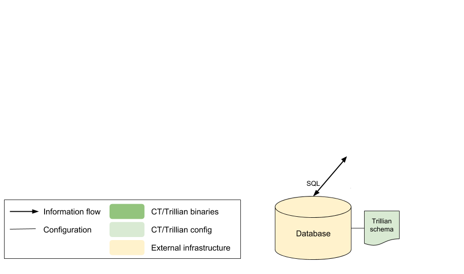
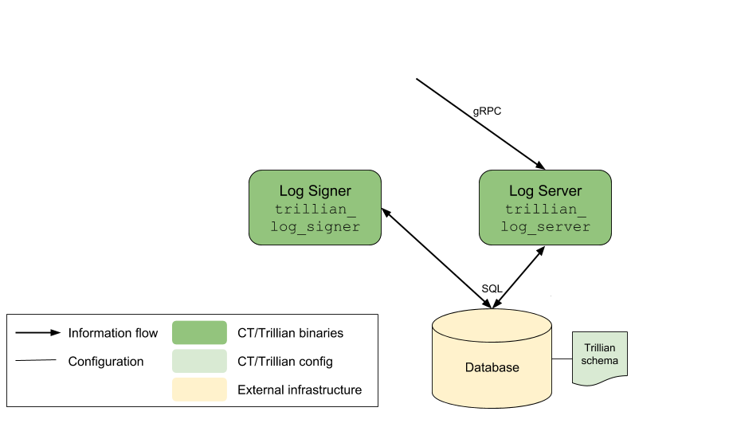
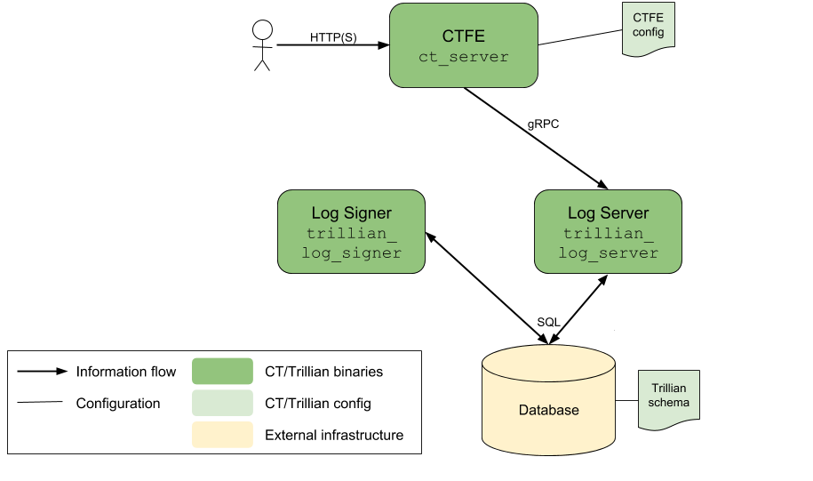
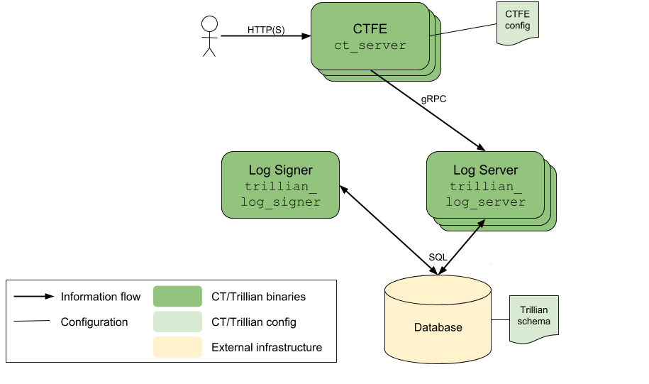
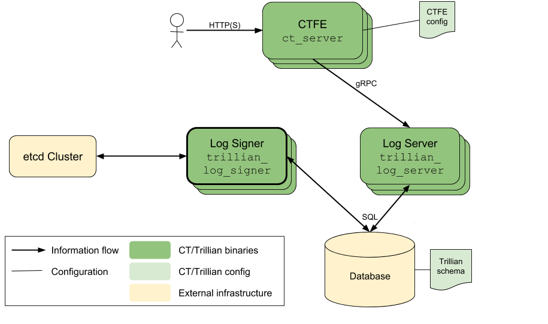
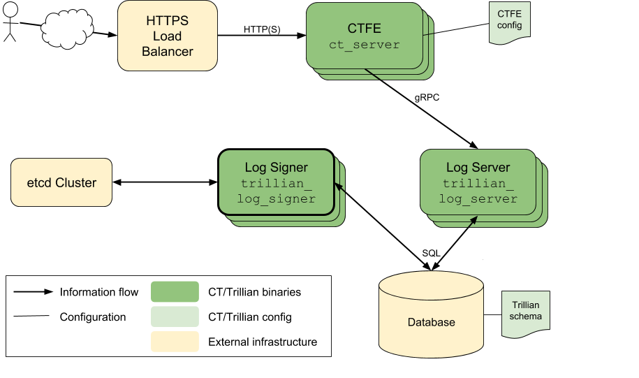
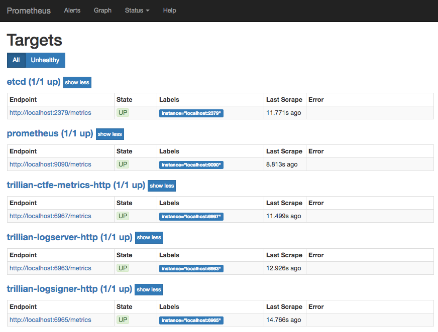
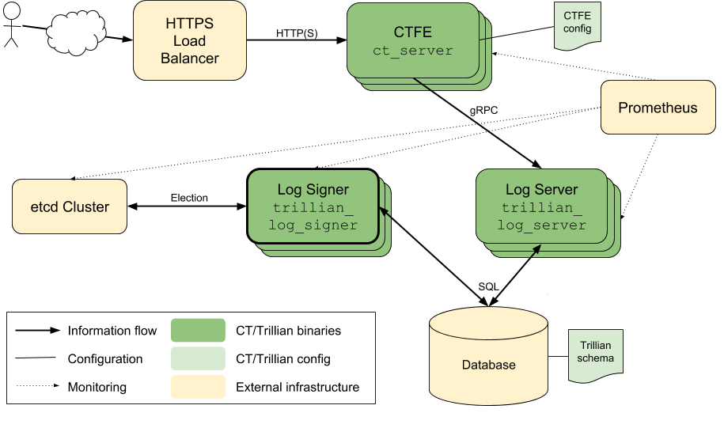

# CT Log Deployment (Manual)

This document describes the individual steps and components involved in the
deployment of a Trillian-based CT Log.  These steps will gradually build up a
system as shown in the diagram below.


The text here describes the general approach, and details key options for
the various binaries involved, but does not give full command-lines.
To see complete details in a machine-executable format (which is therefore
less likely to fall out of date), please consult the various testing
shell scripts:

 - [`trillian/integration/demo-script.sh`](../integration/demo-script.sh)
   runs a simple single-instance test, corresponding to the first few sections
   of this document.
 - [`trillian/integration/ct_integration_test.sh`](../integration/ct_integration_test.sh)
   runs a short integration test against a CT Log system.
 - [`trillian/integration/ct_hammer_test.sh`](../integration/ct_hammer_test.sh)
   runs a continuous integration test against a CT Log system.
 - Both of the previous two tests allow for a more complex CT Log system, using
   the shell functions in
   [`trillian/integration/ct_functions.sh`](../integration/ct_functions.sh)
   and
   [github.com/google/trillian/integration/functions.sh](https://github.com/google/trillian/blob/master/integration/functions.sh).
     - Multiple instances of each component can be invoked.
     - A simple etcd instance can be enabled (by setting the `ETCD_DIR`
       environment variable to the location of etcd binaries)
     - A Prometheus instance can be enabled (by setting the `PROMETHEUS_DIR`
       environment variable to the location of the Prometheus binary).

**Cross-check**s are given throughout the document to allow
confirmation of successful setup.

 - [Data Storage](#data-storage)
 - [Trillian Services](#trillian-services)
 - [Tree Provisioning](#tree-provisioning)
 - [CT Personality](#ct-personality)
    - [Key Generation](#key-generation)
    - [CA Certificates](#ca-certificates)
    - [CTFE Configuration](#ctfe-configuration)
    - [CTFE Start-up](#ctfe-start-up)
 - [Distribution](#distribution)
 - [Primary Signer Election](#primary-signer-election)
 - [Load Balancing](#load-balancing)
 - [Monitoring](#monitoring)
 - [DoS Protection](#dos-protection)
 - [Service Discovery](#service-discovery)

## Data Storage

Data storage for the logged certificates is the heart of a CT Log.  The Trillian
project has an internal storage interface that allows a variety of different
implementations.

This document uses the
[MySQL storage implementation](https://github.com/google/trillian/blob/master/storage/mysql),
which is set up according to the
[instructions in the Trillian repo](https://github.com/google/trillian#mysql-setup);
these instructions configure the Trillian database according to its
[core schema file](http://github.com/google/trillian/blob/master//storage/mysql/storage.sql).


**Cross-check**: At this point, manually connecting to the MySQL database should
succeed:
```
% mysql --host=127.0.0.1 --port=3306 --user=root --database=test
Welcome to the MariaDB monitor.  Commands end with ; or \g.
Your MariaDB connection id is 764
Server version: 10.1.29-MariaDB-6 Debian rodete

Copyright (c) 2000, 2017, Oracle, MariaDB Corporation Ab and others.

Type 'help;' or '\h' for help. Type '\c' to clear the current input statement.

MariaDB [test]> show tables;
+-------------------+
| Tables_in_test    |
+-------------------+
| LeafData          |
| MapHead           |
| MapLeaf           |
| SequencedLeafData |
| Subtree           |
| TreeControl       |
| TreeHead          |
| Trees             |
| Unsequenced       |
+-------------------+
9 rows in set (0.00 sec)

MariaDB [test]> exit
Bye
```

The setup so far is shown as:




## Trillian Services

The next step is to deploy two Trillian processes, the log server and the log
signer.  These binaries are not specific to CT or to WebPKI certificates; they
provide a general mechanism for transparently recording data in a Merkle tree.

The log server (`github.com/google/trillian/server/trillian_log_server`) exposes
a gRPC interface that allows various primitives for querying and adding to the
underlying Merkle tree.  These operations are translated into operations on the
storage layer, which are SQL operations in this example.

 - The `--mysql_uri` option indicates where the MySQL database is available.
 - The `--rpc_endpoint` option for the log server indicates the port that the
   gRPC methods are available on.

However, add operations are not immediately incorporated into the Merkle tree.
Instead, pending add operations are queued up and a separate process, the log
signer (`github.com/google/trillian/server/trillian_log_signer`) periodically
reads pending entries from the queue.  The signer gives these entries unique,
monotonicallly increasing, sequence numbers and incorporates them into the
Merkle tree.

 - The `--mysql_uri` option indicates where the MySQL database is available.
 - The `--sequencer_interval`, `--batch_size` and `--num_sequencers` options
   provide control over the timing and batching of sequencing operations.
 - The `--force-master` option allows the signer to assume that it is the only
   instance running (more on this [later](#primary-signer-election)).
 - The `--logtostderr` option emits more debug logging, which is helpful while
   getting a deployment running.




## Tree Provisioning

The Trillian system is *multi-tenant*: a single Trillian system can support
multiple independent Merkle trees.  However, this means that our particular tree
for holding Web PKI certificates needs to be provisioned in the system.

The `github.com/google/trillian/cmd/createtree` tool performs this provisioning
operation, and emits a **tree ID** that needs to be recorded for later in the
deployment process.

 - The `--admin_server` option for `createtree` indicates the address
   (host:port) that tree creation gRPC requests should be sent to; it should
   match the `--rpc_endpoint` for the log server.
 - Other options (`--pem_key_path`, `--pem_key_password`,
   `--signature_algorithm`) allow control of the private keys used for
   *Trillian*'s signatures over the log's contents.  **Note** that this
   is not the private key used for signing externally-visible content of the CT
   log (see [below](#key-generation)). (Instead, these signatures allow for
   future deployment scenarios where the Trillian services are operated by a
   different entity than the CT personality, and so a trust boundary between
   the two is needed.)


**Cross-check**: Once a new tree has been provisioned, the debug logging for the running
`trillian_log_signer` should include a mention of the new tree.
```
I1011 16:44:16.160069  176101 log_operation_manager.go:210] create master election goroutine for 2385931157013381257
I1011 16:44:17.160875  176101 log_operation_manager.go:246] now acting as master for 1 / 1, master for: <log-2385931157013381257>
```


## CT Personality

Trillian provides a general gRPC API for Merkle tree operations, but relies on a
*personality* to perform operations that are specific to the particular
[transparency application](https://github.com/google/trillian/blob/master/docs/TransparentLogging.md).

For Certificate Transparency, the `ctfe/` directory holds a Trillian personality
which:
 - provides the HTTP/JSON API entrypoints described by [RFC 6962](https://tools.ietf.org/html/rfc6962)
 - checks that submissions to the Log are valid X.509 certificates, with a
   chain of signatures that reaches an acceptable root.

The CTFE personality is generally stateless, and is controlled by a
[configuration file](#ctfe-configuration); the following subsections describe
the key components of this file.

As with the Trillian services, the CTFE is multi-tenant and supports parallel
log instances, each configured separately in the config file.

### Key Generation

Each CT Log needs to have a private key that is used to sign cryptographic
content from the Log.  The [OpenSSL](https://www.openssl.org/) command line can
be used to
[generate](https://wiki.openssl.org/index.php/Command_Line_Elliptic_Curve_Operations#Generating_EC_Keys_and_Parameters)
a suitable private key.

```bash
% openssl ecparam -name prime256v1 > privkey.pem # generate parameters file
% openssl ecparam -in privkey.pem -genkey -noout >> privkey.pem # generate and append private key
% openssl ec -in privkey.pem -pubout -out pubkey.pem # generate corresponding public key
```

The private key must either be for elliptic curves using NIST P-256 (as shown
here), or for RSA signatures with SHA-256 and a 2048 bit (or larger) key
([RFC 6962 s2.1.4](https://tools.ietf.org/html/rfc6962#section-2.1.4)).

**Cross-check**: Confirm that the key is well-formed and readable:
```bash
% openssl ec -in privkey.pem -noout -text # check key is readable
read EC key
Private-Key: (256 bit)
priv:
    00:b5:99:8c:7b:f2:5b:0c:a1:3a:26:b0:12:e2:b7:
    dd:c6:89:a6:49:3c:1d:26:70:44:ad:4a:34:91:2d:
    b6:33:a3
pub:
    04:16:44:9b:04:47:ae:93:f4:14:94:7b:f7:ba:ae:
    5e:6b:53:e3:b4:85:55:ab:f4:06:0f:65:36:bd:f7:
    5f:d7:74:0c:e5:30:c6:a9:0e:0d:40:70:5d:b2:70:
    92:cc:b9:bc:c7:d4:16:7e:96:24:52:6e:1a:a4:28:
    43:d0:b5:97:72
ASN1 OID: prime256v1
NIST CURVE: P-256
% openssl pkey -pubin -in pubkey.pem -text -noout
Public-Key: (256 bit)
pub:
    04:16:44:9b:04:47:ae:93:f4:14:94:7b:f7:ba:ae:
    5e:6b:53:e3:b4:85:55:ab:f4:06:0f:65:36:bd:f7:
    5f:d7:74:0c:e5:30:c6:a9:0e:0d:40:70:5d:b2:70:
    92:cc:b9:bc:c7:d4:16:7e:96:24:52:6e:1a:a4:28:
    43:d0:b5:97:72
ASN1 OID: prime256v1
NIST CURVE: P-256
```

**Cross-check**: Once the CTFE is configured and running
([below](#ctfe-start-up)), the `ctclient` command-line tool allows signature
checking against the public key with the `--pub_key` option:
```bash
% go install github.com/google/certificate-transparency-go/client/ctclient
% ctclient --log_uri http://localhost:6966/aramis --pub_key pubkey.pem sth
2018-10-12 11:28:08.544 +0100 BST (timestamp 1539340088544): Got STH for V1 log (size=11718) at http://localhost:6966/aramis, hash 6fb36fcca60d61aa85e04ff0c34a87782f12d08568118602eec0208d85c3a40d
Signature: Hash=SHA256 Sign=ECDSA
Value=3045022100df855f0fd097a45070e2eb244c7cb63effda942f2d30308e3b84a72e1d16118b0220038e55f142501402cf03790b3997081f82ffe47f2d3f3b667e1c484aecf40a33
```

### CA Certificates

Each Log must decide on its own policy about which CA's certificates are to be
accepted for inclusion in the Log; this section therefore just provides an
*example* of the process of configuring this set for the CT Log software.

On a Debian-based system, the `ca-certificates` package includes a collection
of CA certificates under `/etc/ssl/certs/`.  A set of certificates suitable
for feeding to `ct-server` can thus be produced with:

```bash
% sudo apt-get install -qy ca-certificates
% sudo update-ca-certificates
% cat /etc/ssl/certs/* > ca-roots.pem
```

**Cross-check**: Once the CTFE is configured and running
([below](#ctfe-start-up)), opening
`http://localhost:<port>/<prefix>/ct/v1/get-roots` shows the configured roots.
Alternatively, the `ctclient` command-line tool shows the same information in a
more friendly way:

```bash
% go install github.com/google/certificate-transparency-go/client/ctclient
% ctclient --log_uri http://localhost:6966/aramis getroots
Certificate:
    Data:
        Version: 3 (0x2)
        Serial Number: 67554046 (0x406cafe)
    Signature Algorithm: ECDSA-SHA256
...
```


### CTFE Configuration

The information from the previous steps now needs to be assembled into a
configuration file for the CTFE, in
[text protocol buffer format](https://developers.google.com/protocol-buffers/docs/overview).

Each Log instance needs configuration for:
 - `log_id`: The Trillian tree ID from an [earlier step](#tree-provisioning)
 - `prefix`: The path prefix the log will be served at.
 - `max_merge_delay_sec`: The MMD for the log (typically 86400, which is 24 hours).
 - `roots_pem_file`: The files holding
   [accepted root CA certificates](#ca-certificates) (repeated).
 - `private_key`: The [private key](#key-generation) for the log instance.
    For a private key held in an external PEM file, this is of the form:
     ```
     private_key: {
       [type.googleapis.com/keyspb.PEMKeyFile] {
         path: "privkey.pem"
       }
     }
     ```
 - `public_key`: The corresponding public key for the log instance.  (This is
   not actually used by the CTFE, but is worth including for reference and for
   use by test tools.)

**Cross-check**: The config file should be accepted at start-up by the
`ct_server` binary, with the `--log_config` option.


### CTFE Start-up

Once the CTFE config file has been assembled, the CTFE personality
(`github.com/google/certificate-transparency-go/trillian/ctfe/ct_server`)
can be started.

 - The `--log_config` option gives the location of the configuration file.
 - The `--log_rpc_server` option gives the location of the Trillian log server;
   it should match the `--rpc_endpoint` for the [log server](#trilian-services).
 - The `--http_endpoint` option indicates the port that the CTFE should respond
   to HTTP(S) requests on.

At this point, a complete (but minimal) CT Log setup is available. The manual
set up steps up to this point match the
[integration demo script](../integration/demo-script.sh); the contents of that
script should (mostly) make sense.

**Cross-check**: Opening `http://localhost:<port>/<prefix>/ct/v1/get-sth` in a
browser should show JSON that indicates an empty tree.
Alternatively, the `ctclient` command-line tool shows the same information:
```bash
% go install github.com/google/certificate-transparency-go/client/ctclient
% ctclient --log_uri http://localhost:6966/aramis sth
2018-10-12 11:28:08.544 +0100 BST (timestamp 1539340088544): Got STH for V1 log (size=11718) at http://localhost:6966/aramis, hash 6fb36fcca60d61aa85e04ff0c34a87782f12d08568118602eec0208d85c3a40d
Signature: Hash=SHA256 Sign=ECDSA
Value=3045022100df855f0fd097a45070e2eb244c7cb63effda942f2d30308e3b84a72e1d16118b0220038e55f142501402cf03790b3997081f82ffe47f2d3f3b667e1c484aecf40a33
```




## Distribution

For any real-world deployment, running a single instance of each binary in the
system is not enough &ndash; let alone for a CT Log that will form part of the
WebPKI ecosystem.

 - Running multiple binary instances allows the Log to scale with traffic
   levels, by adjusting the number of instances.
 - Running instances in distinct locations reduces the chance of a
   single external event affecting all instances simultaneously.  (In terms of
   cloud computing providers, this means that instances should be run in
   different zones/regions/availability zones.)

For the [CTFE personality](#ctfe-start-up), running multiple instances is
straightforward: just run more copies of the `ct_server` binary.

> Note that for a test of this with multiple *local* instances, each instance
> will need to be configured to listen on a distinct port.

Running multiple instances of the [log server](#trillian-services) process also
just involves running more copies of the `trillian_log_server` binary.
However, this does need the CTFE personality to be configured with the locations
of all of the different log server instances.

The simplest (but not very flexible) way to do this is a comma-separated list:
```
ct_server --log_rpc_server host1:port1,host2:port2,host3:port3
```

(More flexible approaches are discussed [below](#service-discovery).)




## Primary Signer Election

The Trillian log signer requires more care to convert to a multiple-instance
system.  The underlying Merkle tree relies on there being a unique
sequencing of the entries in the tree, and the signer is responsible for
generating that sequence.

As a result, multiple instances of the log signer are run to improve resilience,
not scalability.  At any time only a single signer instance is responsible
for the sequencing of a particular Merkle tree.

This single-signer constraint is implemented as an *election* process, and the
provided implementation of this process relies on an
[etcd](https://coreos.com/etcd/) cluster to provide data synchronization and
replication facilities.

For resilience, the `etcd` cluster for a CT Log should have multiple `etcd`
instances, but does not need large numbers of instances (and in fact large
numbers of `etcd` instances will slow down replication).

The
[CoreOS `etcd` documentation](https://coreos.com/etcd/docs/latest/clustering.html)
covers the process of setting up an `etcd` cluster.  Once this is set up,
multiple instances of the `trillian_log_signer` binary can be run with:

 - The `--etcd_servers` option set to the location of the etcd cluster (as a
   comma-separated list of host:port pairs).
 - The `--force_master` option removed.




## Load Balancing

The deployment described so far involves a collection of CTFE personalities, each
serving HTTP(S) at a particular end-point.  A real deployment is likely to
involve front-end load balancing between these instances, possibly also
including SSL termination for HTTPS.

Setup and configuration of these reverse-proxy instances is beyond the scope of
this document, but note that cloud environments often provide this functionality
(e.g. [Google Cloud Platform](https://cloud.google.com/compute/docs/load-balancing/http/),
[Amazon EC2](http://aws.amazon.com/documentation/elastic-load-balancing/)).




## Monitoring

A live CT Log deployment needs to be monitored so that availability and
performance can be tracked, and alerts generated for failure conditions.

Monitoring can be broken down into two main styles:
 - *Black-box* monitoring, which queries the system from the outside, using the
   same mechanisms that real user traffic uses.
 - *White-box* monitoring, which queries the internal state of the system,
   using information that is not available to external users.

Black-box monitoring is beyond the scope of this document, but tools such as
[Blackbox exporter](https://github.com/prometheus/blackbox_exporter) can be
used to (say) check the `https://<log>/ct/v1/get-sth` entrypoint and export the
resulting data to Prometheus.

For white-box monitoring, all of the binaries in the system export metrics via
`/metrics` an HTTP server, provided that the `--http_endpoint` option was
specified on their invocation.

This allows a pull-based monitoring system such as
[Prometheus](https://prometheus.io/) to poll for information/statistics, which
can then feed into alerts and dashboards.

Configuration of Prometheus is beyond the scope of this document, but a minimal
sample console is [available](../integration/consoles/)

**Cross-check**: Once running, Prometheus shows the expected collection of
targets to monitor under `http:<prometheus-host>:9090/targets`.



**Cross-check**: Once running, Prometheus shows the a sensible tree size graph
under `http:<prometheus-host>:9090/consoles/trillian.html`.


The addition of Prometheus for monitoring yields a system setup as shown.




## DoS Protection

A live production system that is exposed to the general Internet needs
protection against traffic overload and denial-of-service attacks.

The `--quota_system=etcd` option (which requires the `--etcd_servers` option)
for the log server and log signer enables a simple etcd-based quota system,
[documented here](https://github.com/google/trillian/blob/master/quota/etcd/README.md).

At this point, we have configured a full CT Log system.


## Service Discovery

The distributed configuration described in the previous sections was not very
flexible, as it involved lists of host:port entries.  However, now that an
etcd cluster is [available](#primary-signer-election), it can be used to allow
more dynamic discovery of running services: services register themselves with
etcd so that other services can find their locations.

A log server executable that has the `--etcd_servers` option can also take
an `--etcd_service` option which indicates which service name it registers
against. Likewise, if the CTFE is run with the `--etcd_servers` option, the
`--log_rpc_server` argument is interpreted as an etcd service name to query for
gRPC endpoint resolution.

Similarly, the set of metrics-displaying targets that are available for
monitoring can be registered as an etcd service using the `--etcd_http_service`
option to indicate the relevant service name.

For Prometheus-based monitoring, the `etcdiscover` utility
(`github.com/google/trillian/monitoring/prometheus/etcdiscover`) monitors a
collection of etcd services and continually updates a YAML configuration
file, so that the set of monitored targets is dynamically updated.

**Cross-check**: The current registered endpoints for a service can be queried
with the `etcdctl` tool:
```bash
% export ETCDCTL_API=3
% etcdctl get trillian-logserver/ --prefix
trillian-logserver/localhost:6962
{"Op":0,"Addr":"localhost:6962","Metadata":null}
```
